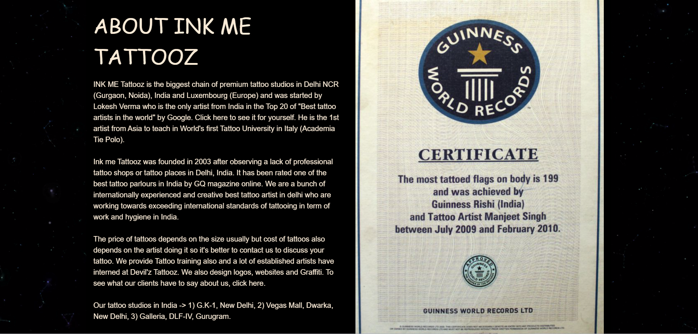
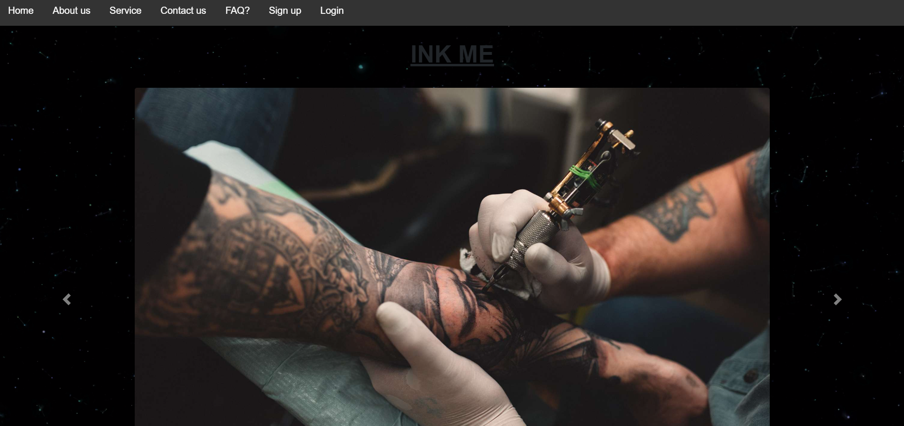
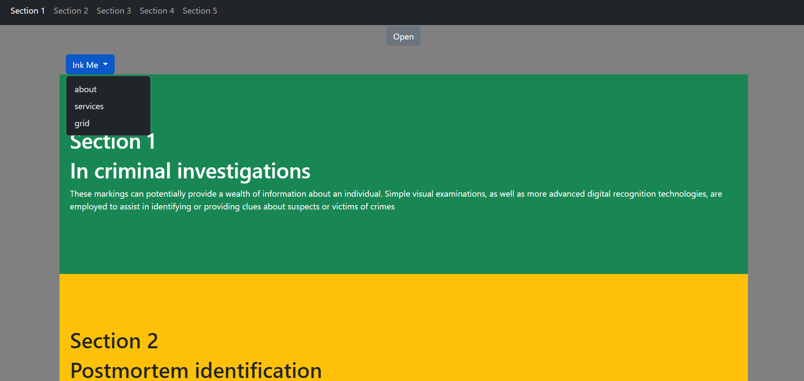
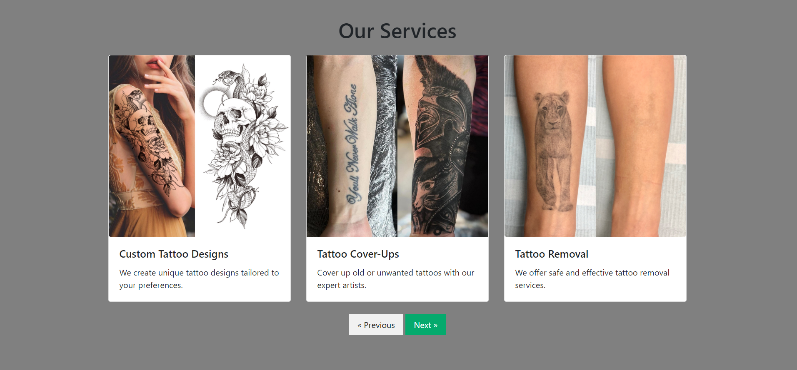
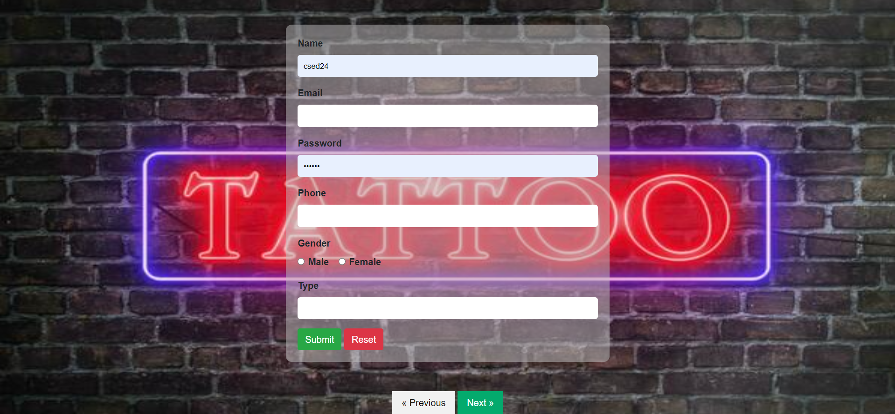
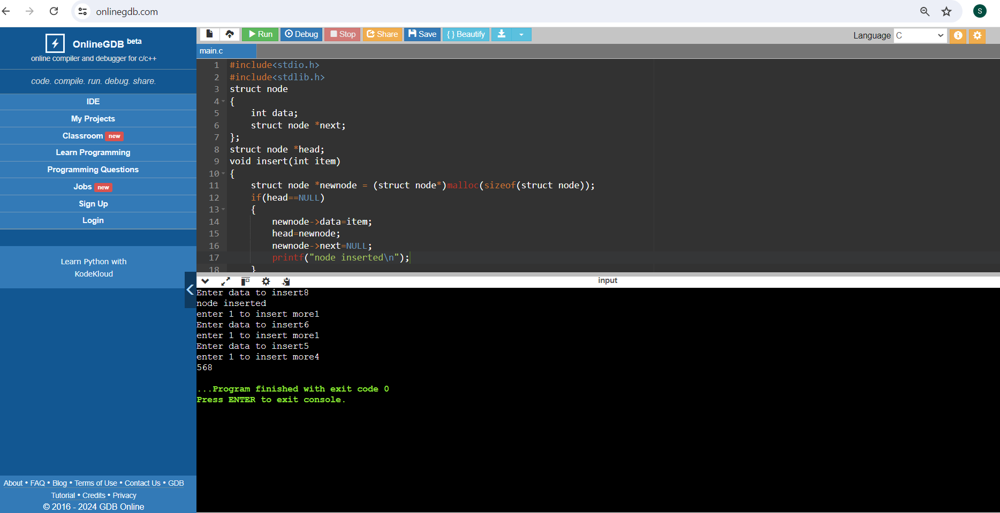
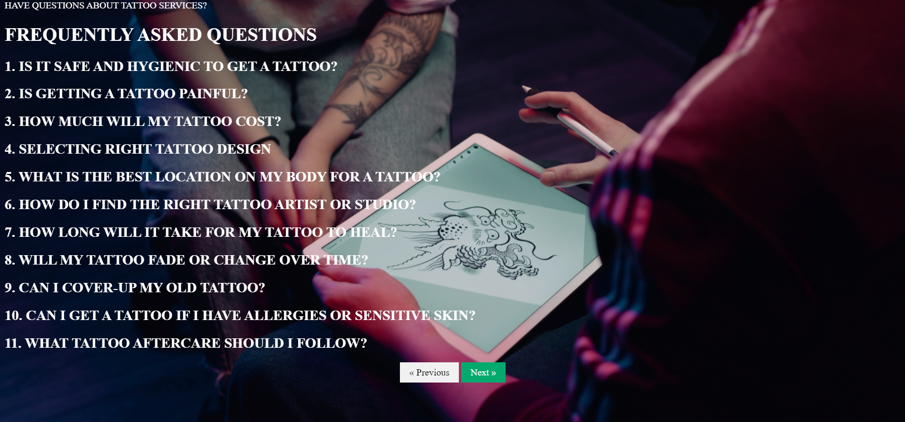

# A Webpage using Bootstrap

### Welcome to Ink Me!

*About Us*

At Ink Me, we believe in the power of ink to tell stories, celebrate individuality, and transform bodies into works of art. Our mission is to provide a professional, creative, and welcoming environment where each client’s vision can come to life through exceptional tattoo artistry.

*Who We Are*

Founded in 2003, Ink Me has grown from a small, passionate team of artists into a thriving community hub for tattoo enthusiasts. Our artists bring a diverse range of styles and techniques, ensuring that every tattoo is a unique expression of the wearer’s personality and story.

*Our Values*

Creativity: We embrace artistic freedom and encourage innovative designs that push the boundaries of traditional tattooing.
Professionalism: Our team is dedicated to upholding the highest standards of hygiene, safety, and client care.
Inclusivity: We celebrate diversity and strive to create a space where everyone feels welcome and respected.
Community: We are committed to supporting and engaging with our local community through events, collaborations, and outreach.

*What We Offer*

Custom Tattoos: Collaborate with our talented artists to design a tattoo that’s uniquely yours.
Flash Tattoos: Choose from a selection of pre-designed tattoos for a quicker and often more affordable option.
Cover-Ups and Reworks: Transform or refresh existing tattoos with our expert touch.
Consultations: Schedule a consultation to discuss your ideas and get professional advice on design and placement.

*Why Choose Us?*

At Ink Me, we are dedicated to providing a memorable tattoo experience. From your initial consultation to the final inking, we prioritize clear communication, quality artistry, and client satisfaction. Our portfolio of work speaks for itself, showcasing a wide range of styles from traditional to modern.

*Contact Us*

For inquiries, appointments, or just to say hello, feel free to reach out:

Email: info@tattooshop.com

Phone: (123) 456-7890

Location: 123 Main Street City, State ZIP.

Social Media: Ink_Me

Thank you for considering *Ink Me* for your next tattoo. We look forward to bringing your vision to life!
